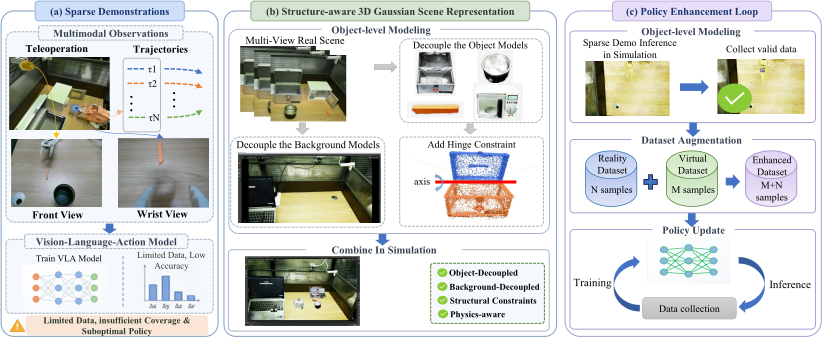

# Object-Decoupled 3DGS for Structure-Constrained Data Expansion

[](https://www.python.org/)
[](LICENSE)
[](docs/MANUSCRIPT_ALIGNMENT.md)

Paper-facing code, experiment records, and project page for:

**Object-Decoupled 3D Gaussian Splatting for Structure-Constrained Data Expansion in Sparse-Demonstration Robot Learning**

Anonymous Authors

Under double-blind review

[Project page](docs/index.html) · [Reproduction guide](docs/REPRODUCIBILITY.md) ·
[Data documentation](docs/DATA.md) · [Release checklist](docs/RELEASE_CHECKLIST.md) ·
[中文说明](README_zh-CN.md)



## Overview

Sparse real demonstrations cover only a narrow part of the state-action space
needed for robust manipulation. This repository implements a closed-loop data
expansion framework with three components:

1. **Sparse-demonstration policy learning.** The released GR00T N1.7 model is
   fine-tuned with two training-only sequence regularizers. Model architecture,
   action sampling, and inference cost remain unchanged.
2. **Object-decoupled structural scenes.** Foreground objects and background are
   represented separately. Rigid-pose ranges and hinge parameters provide a
   low-dimensional interaction manifold for 3DGS assets.
3. **Screened virtual rollouts.** The current policy interacts with randomized
   virtual scenes. Candidates enter incremental training only after the
   implemented kinematic and geometric checks and a recorded manual review.

The framework is not a new VLA architecture and does not treat arbitrary
synthetic trajectories as valid training data.

## Reported Results

The release preserves the distinct denominators used by the manuscript:

| Evaluation batch | Result | Statistical unit |
|---|---:|---|
| Three-task method comparison | 259/300, 86.3% | Trial-weighted over five seeds |
| Sparse-only comparator | 226/300, 75.3% | Same three-task batch |
| Four-task real deployment | 178/210, 84.8% | Separate trial-weighted batch |
| Four-task ablation | 84.4% | Macro mean over 20 paired task-by-seed cells |
| Final virtual-rollout acceptance | 2390/2520, 94.8% | Three-task final iteration |
| Object-decoupled 3DGS | 27.68 PSNR, 0.895 SSIM, 0.110 LPIPS | Unweighted mean over 9 scenes and 69 held-out views |

These batches are intentionally not pooled. The exact records and aggregation
rules are documented in [docs/DATA.md](docs/DATA.md).

## Repository Layout

```text
configs/                    Resolved paper and pipeline configuration
docs/                       GitHub Pages project site and reproduction notes
examples/real_data/         Paper-facing trial, rollout, reconstruction, and ablation records
examples/structured_scene/  Hinge metadata schema
integrations/gr00t_n1_7/    Training-only regularization integration hook
scripts/                    CSV validation, figure reproduction, PLY splitting, run manifests
src/odgs_sparse_demo/       Core reference implementation
tests/                      Unit and release-consistency tests
```

The core modules correspond directly to the method:

| Manuscript component | Implementation |
|---|---|
| Training-only loss terms | `regularization.py` |
| Rigid and hinge scene states | `scene.py` |
| Attribute-preserving Gaussian PLY split | `gaussian_ply.py` |
| Automatic checks and manual-review provenance | `feasibility.py` |
| Screened rollout and incremental update loop | `pipeline.py` |
| Metrics and confidence intervals | `metrics.py` |

## Quick Start

```bash
git clone <repository-url>
cd object-decoupled-3dgs-sparse-demo
python -m venv .venv
source .venv/bin/activate          # Windows: .venv\Scripts\activate
python -m pip install -e ".[dev,figures]"
python scripts/validate_paper_csvs.py
python -m pytest
```

Reproduce the three iteration figures as separate vector files:

```bash
python scripts/plot_iteration_results.py \
  --data examples/real_data/iteration_results_long.csv \
  --output-dir outputs/iteration_figures
```

This writes separate task-success, rollout-acceptance, and action-curvature
figures. Success and acceptance use Wilson intervals over count data; action
curvature uses 95% t intervals over five seed means.

## Training Integration

Install policy dependencies only in the GR00T environment:

```bash
python -m pip install -e ".[policy]"
```

The integration hook composes

```text
L = L_flow + 0.05 L_temporal + 0.02 L_velocity
```

using the existing predicted vector field, noisy action trajectory, diffusion
time, and action mask. See
[integrations/gr00t_n1_7/README.md](integrations/gr00t_n1_7/README.md).

## Structured 3DGS Assets

The release assumes that multiview calibration, instance masks, and a trained
Gaussian PLY are available. The attribute-preserving split utility separates a
hinged asset while retaining opacity, scale, rotation, and spherical-harmonic
fields:

```bash
python scripts/split_gaussian_asset.py scene.ply \
  --output-dir outputs/medicine_box \
  --plane-point 0.0,0.0,0.0 \
  --plane-normal 0.0,1.0,0.0 \
  --hinge-center 0.0,0.0,0.0 \
  --hinge-axis 1.0,0.0,0.0
```

The numeric values above illustrate the command format and are not manuscript
measurements. Use calibrated object-specific values and record the generated
`hinge_split.json`. 3DGRUT export, collision-proxy generation, IsaacLab scene
assembly, and LeIsaac dataset conversion remain separate upstream stages; the
tested versions are pinned in [docs/UPSTREAMS.md](docs/UPSTREAMS.md).

## Screening Scope

The implemented predicate checks collision-proxy penetration, workspace and
joint limits, target visibility, hinge limits, structural residuals, and action
curvature. Manual review records task-stage completeness, obvious contact or
interpenetration anomalies, and rendering or annotation failures. Passing this
predicate means passing these implemented checks. It does not validate contact
force, friction, or dynamic stability.

## Release Boundary

This repository contains source code, resolved configuration, paper-facing CSV
records, vector manuscript figures, and compressed demonstration GIFs. It does
not include identifiable raw laboratory video, pretrained or fine-tuned model
weights, licensed upstream source trees, Word or LaTeX submission files,
EndNote libraries, PPT working files, or revision artifacts.

## Citation

```bibtex
@article{anonymous2026objectdecoupled3dgs,
  title   = {Object-Decoupled 3D Gaussian Splatting for Structure-Constrained
             Data Expansion in Sparse-Demonstration Robot Learning},
  author  = {Anonymous Authors},
  year    = {2026},
  note    = {Manuscript under double-blind review}
}
```

## License

Original code in this repository is released under the
[Apache License 2.0](LICENSE). Referenced upstream projects retain their own
licenses. Project-page acknowledgements are listed in
[docs/SITE_ATTRIBUTION.md](docs/SITE_ATTRIBUTION.md).
